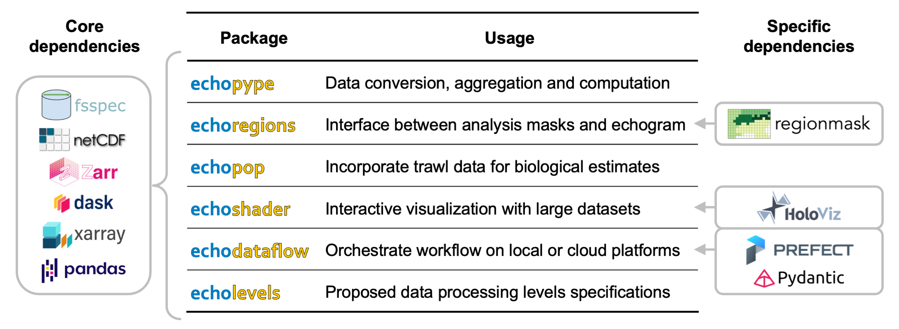

[Water column sonar data collected by echosounders](https://storymaps.arcgis.com/stories/e245977def474bdba60952f30576908f) are essential for fisheries and marine ecosystem research, enabling the detection, classification, and quantification of fish and zooplankton from many different ocean observing platforms. However, the broad usage of these data has been hindered by the lack of modular software tools that allow flexible composition of data processing workflows that incorporate powerful analytical tools in the scientific Python ecosystem.

We address this gap by developing **Echostack**, a suite of open-source Python software packages that leverage existing distributed computing and cloud-interfacing libraries to support intuitive and scalable data access, processing, and interpretation. These tools can be used individually or orchestrated together, which we demonstrate in example use cases for a fisheries acoustic-trawl survey.

Below is a summary of the Echostack package:

  
  <b>Bat call activity detected in two UBNA sites in 2022.</b>

For more information, check out each of the code repositories:
- [Echopype](https://github.com/OSOceanAcoustics/echopype): performs data standardization and computation from raw instrument files to acoustic data products
  - Check out the [Echopype paper in ICES Journal of Marine Science](https://doi.org/10.1093/icesjms/fsae133)
- [Echopop](https://github.com/OSOceanAcoustics/echopop): generates acoustically derived biological estimates, such as abundance
  - Learn more on the [Echopop project page](../../project_others/echopop/)
- [Echoshader](https://github.com/OSOceanAcoustics/echoshader): enables interactive acoustic data visualization and exploration
- [Echoregions](https://github.com/OSOceanAcoustics/echoregions): interfaces acoustic data with machine learning developments
- [Echodataflow](https://github.com/OSOceanAcoustics/echodataflow): workflow orchestration via text-based configuration “recipes” instead of code

These packages are accompanied by a set of data processing level definitions, [Echolevels](https://github.com/OSOceanAcoustics/echolevels), which categorizes data products at different workflow stages to enhance data understanding and provenance tracking.

Check out Wu-Jung's talk at SciPy 2024 and the associated [paper](https://doi.org/10.25080/WXRH8633) in the proceedings!


**Funding**: 
- NOAA Fisheries
- NOAA Office of Ocean Exploration and Research [FY2021 grants](https://oceanexplorer.noaa.gov/news/oer-updates/2021/fy21-ffo-schedule.html)