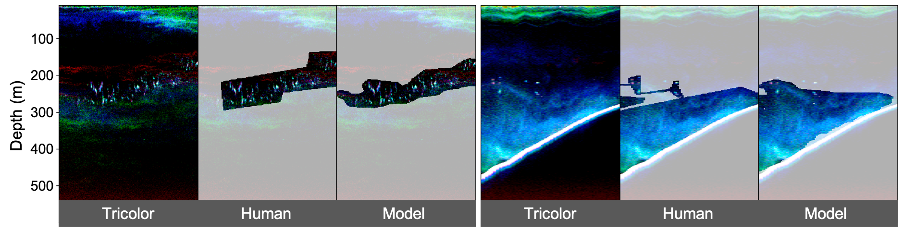

[Active acoustic data collected by echosounders](https://storymaps.arcgis.com/stories/e245977def474bdba60952f30576908f) (high-frequency sonar systems) play a crucial role in marine ecological research and fisheries stock assessments. Recent technical advancements has further integrated echosounders onto many ocean observing platforms, leading to the rapid accumulation of echosounder data worldwide.

In this project, we tackle the challenge of translating experiences from human experts into machine learning models capable of efficiently extracting biological information from large echosounder dataset. Using the rich dataset collected by the [Joint U.S.-Canada Integrated Ecosystem and Pacific Hake Acoustic Trawl Survey](https://www.fisheries.noaa.gov/west-coast/science-data/joint-us-canada-integrated-ecosystem-and-pacific-hake-acoustic-trawl-survey) dated back to early 2000s, we are developing deep learning models to automatically annotate echograms—color-coded visual representations of echo returns—with the presence of specific fish and zooplankton species or taxa.
 
In the first stage of the project, we are focusing on developing [an echogram segmentation model to identify Pacific hake](/talk/202405-asa-ottawa-hake/), a keystone species and the largest fishery stock on the west coast of the US. Identifying hake on echograms is more challenging compared to many other fish species, due to their polymorphic appearance and diffused school boundaries. We found that neural networks' large learning capacity are well-suited to address these complexities. However, as in many other domains, organizing echosounder data with survey metadata and sorting expert annotations remains a significant bottleneck in fully leveraging these technologies. 

Moving forward, we aim to expand the model to include other ecologically and commercially important fish species in the California Current ecosystem, and incorporate other analytical methods, such as Bayesian inversion techniques, to improve acoustic data interpretation and biomass estimation accuracy.

<!-- To take full advantage of these large and complex new datasets, in this project we aim to combine the development of machine learning methodology with a cloud-based workflow to accelerate the extraction of biological information from fisheries acoustic data. Our group has developed and used [Echopype](https://echopype.readthedocs.io/en/stable/), a Raw Sonar Backscatter data parsing Python package, and [Echoregions](https://echoregions.readthedocs.io/en/latest/), an Echoview annotation data parsing Python package. Transferring data from Echoview and proprietary echosounder formats to Python data products enables seamless integration with a rich ecosystem of scientific computing tools developed by a vast community of open-source contributors, thus allowing us to use our data to train deep learning models to predict regions of interest in echograms.

 -->

This project is in close collaboration with the [Fisheries Engineering and Acoustics Technology (FEAT) team](https://www.fisheries.noaa.gov/west-coast/sustainable-fisheries/fisheries-engineering-and-acoustic-technologies-team) at the NOAA Fisheries [Northwest Fisheries science center (NWFSC)](https://www.fisheries.noaa.gov/about/northwest-fisheries-science-center).

**Funding agency**: NOAA Fisheries
