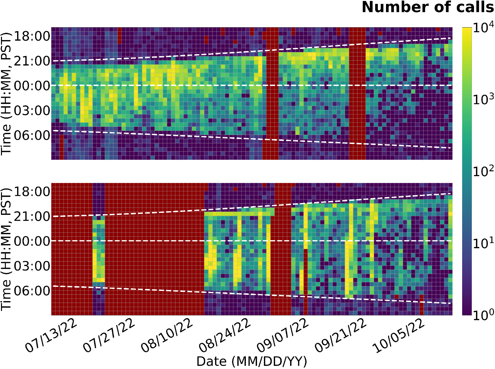

Passive acoustic monitoring (PAM) has become a useful technique for monitoring soniferous animals in both terrestrial and marine habitats, and has in recent years been particularly bolstered by the broader availability and accessibility of low-cost recording devices.

In this project, we deploy low-cost [AudioMoth](https://www.openacousticdevices.info/audiomoth) recorders at multiple sites in the [Union Bay Natural Area](https://botanicgardens.uw.edu/center-for-urban-horticulture/visit/union-bay-natural-area/), right on the eastern edge of the University of Washington, Seattle campus. Since the project began in fall 2021, we have collected over 30 TB of recordings that are embedded with sounds from a wide variety of animals (e.g., birds, bats, frogs) and anthopogenic sources (e.g., airplanes, football stadium roars).

Beyond generating a rich dataset, the project fieldwork and data analysis provides an accesible entry point for students to engage in real-world bioacoustics research, with hands-on data science and instrumentation opportunities.

We have leveraged this dataset to investigate the [impact of duty cycle recording on bat monitoring](/talk/202405-aditya-duty-cycle/) and support multiple capstone projects in the [UW Data Sciene Master's Program](https://www.washington.edu/datasciencemasters/), focused on developing open-source, cloud-hosted workflows for analyzing large PAM datasets. With these tools in place, going forward we plan to characterize the seasonal soundscape fluctuations in UBNA with respect to weather/climate events, and find opportunities to expand this effort to a community monitoring program in the Greater Seattle area.

  
  <b>Bat call activity detected in two UBNA sites in 2022.</b>

**Funding**: [UW Royalty Research Fund](https://www.washington.edu/research/or/royalty-research-fund-rrf/)
